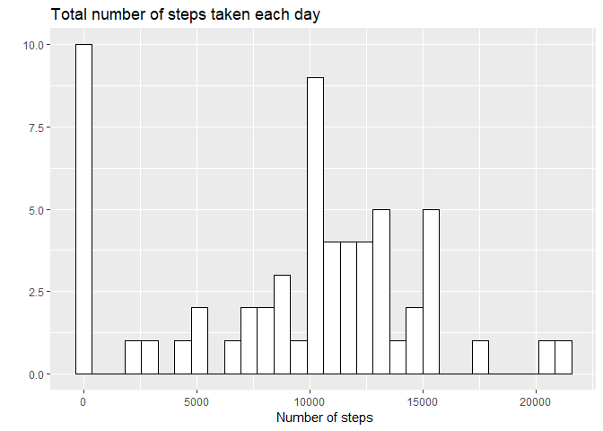
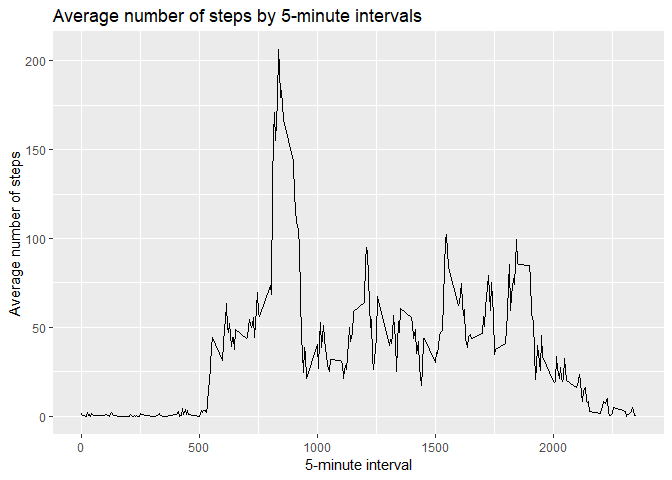
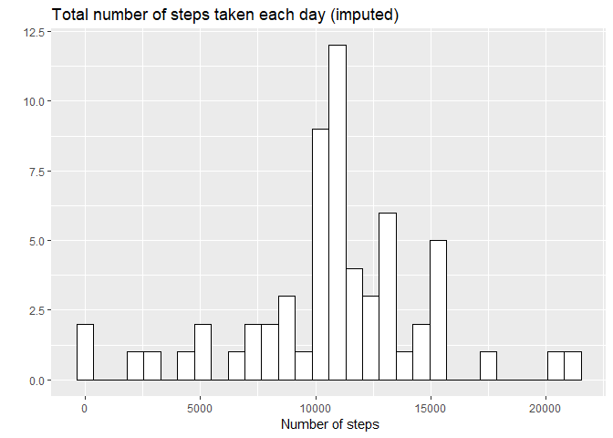
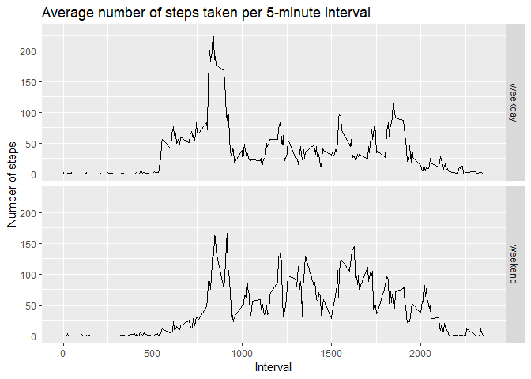

## Loading and preprocessing the data

First, let's load the data into R.


```r
fileList <- unzip("activity.zip", list = TRUE)
activity <- read.csv(unz("activity.zip", fileList[, 1]))
```

Then, tranform variable "date" in the dataset to date format.


```r
activity <- transform(activity, date = as.Date(as.character(date), "%Y-%m-%d"))
```

## What is mean total number of steps taken per day?

Question 1: Calculate the total number of steps taken per day.

First, call the library "dplyr".


```r
library(dplyr)
```

Here is the code to calculate the total number of steps taken per day.


```r
totalsteps1 <- activity %>% group_by(date) %>% 
        summarize(tot_steps = sum(steps, na.rm = TRUE))
```

Question 2: Make a histogram of the total number of steps taken each day.

First, call the library "ggplot2".


```r
library(ggplot2)
```

Here is the histogram of the total number of steps taken each day.


```r
ggplot(totalsteps1, aes(x = tot_steps)) + 
        geom_histogram(bins = 30, na.rm = TRUE, color = "black", fill = "white") + 
        labs(title = "Total number of steps taken each day", 
             x = " Number of steps", 
             y = "")
```

<!-- -->

Question 3: Calculate and report the mean and median of the total number of 
steps taken per day

The mean of the total number of steps taken per day is:


```r
(mean1 <- mean(totalsteps1$tot_steps, na.rm = TRUE))
```

```
## [1] 9354.23
```

The median of the total number of steps taken per day is:


```r
(median1 <- median(totalsteps1$tot_steps, na.rm = TRUE))
```

```
## [1] 10395
```

## What is the average daily activity pattern?

Question 1: Make a time series plot (i.e. type = "l") of the 5-minute interval 
(x-axis) and the average number of steps taken, averaged across 
all days (y-axis)


Here is the code to calculate the average number of steps taken each 5-minute
interval.


```r
av_intervals <- activity %>% group_by(interval) %>%
        summarize(av_steps = mean(steps, na.rm = TRUE))
```

Here is the time series plot.


```r
ggplot(av_intervals, aes(x = interval, y = av_steps)) + 
        geom_line() + 
        labs(title = "Average number of steps by 5-minute intervals",
             x = "5-minute interval", 
             y = "Average number of steps")
```

<!-- -->

Question 2: Which 5-minute interval, on average across all the days in the dataset, 
contains the maximum number of steps?

The 5-minute interval contains the maximum number of steps is:


```r
as.numeric(av_intervals[which.max(av_intervals$av_steps), ][1, 1])
```

```
## [1] 835
```

## Imputing missing values

Question 1: Calculate and report the total number of missing values in the dataset 
(i.e. the total number of rows with NAs)

The number of missing values in the dataset is:


```r
sum(is.na(activity$steps))
```

```
## [1] 2304
```

Question 2: Devise a strategy for filling in all of the missing values in the dataset. 
The strategy does not need to be sophisticated. For example, you could use 
the mean/median for that day, or the mean for that 5-minute interval, etc.

We'll replace a missing value with the mean for its 5-minute interval.
To do so, we first add the variable "av_steps" (i.e. the average number of steps
taken each 5-minute interval) to the original dataset by merging the 2 datasets 
"activity" and "av_intervals".


```r
activity_imputed <- arrange(merge(activity, av_intervals, by = "interval"), 
                            date, interval)
```

Then, we replace missing values with the its 5-minute interval's average 
number of steps.


```r
activity_imputed$steps[is.na(activity_imputed$steps)] <- 
        activity_imputed$av_steps[is.na(activity_imputed$steps)]
```

Question 3: Make a histogram of the total number of steps taken each day.

First, calculate the total number of steps taken each day, with the imputed data.


```r
totalsteps_imputed <- activity_imputed %>% group_by(date) %>% 
        summarize(tot_steps = sum(steps, na.rm = TRUE))
```

Here is the histogram of the total number of steps taken each day.


```r
ggplot(totalsteps_imputed, aes(x = tot_steps)) + 
        geom_histogram(bins = 30, na.rm = TRUE, color = "black", fill = "white") +
        labs(title = "Total number of steps taken each day (imputed)", 
             x = " Number of steps", 
             y = "")
```

<!-- -->

The mean of the total number of steps taken per day is:


```r
(mean2 <- mean(totalsteps_imputed$tot_steps, na.rm = TRUE))
```

```
## [1] 10766.19
```

The mean of the total number of steps taken per day is:


```r
(median2 <- median(totalsteps_imputed$tot_steps, na.rm = TRUE))
```

```
## [1] 10766.19
```

Let's compare these values with the estimates from the first part of the assignment.


```r
data.frame(mean = c(mean1, mean2), median = c(median1, median2), 
           row.names = c("Orginal", "Imputed"))
```

```
##             mean   median
## Orginal  9354.23 10395.00
## Imputed 10766.19 10766.19
```

## Are there differences in activity patterns between weekdays and weekends?

Question 1: Create a new factor variable in the dataset with two levels – “weekday” 
and “weekend” indicating whether a given date is a weekday or weekend day.

Here is the code.


```r
activity_imputed$day <- as.factor(NA)
levels(activity_imputed$day) <- c("weekday", "weekend")
weekend <- c("Saturday", "Sunday")
for (i in (1:nrow(activity_imputed))) {
        if (weekdays(activity_imputed$date[i]) %in% weekend) {
                activity_imputed$day[i] <- "weekend"
        } else {
                activity_imputed$day[i] <- "weekday"
        }
}
```

Question 2: Make a panel plot containing a time series plot (type = "l") of 
the 5-minute interval (x-axis) and the average number of steps taken, averaged 
across all weekday days or weekend days (y-axis).

First, calculate the average number of steps taken per 5-minute intervals, 
for weekday days and weekend days.


```r
grouped_data <- activity_imputed %>% group_by(day, interval) %>% 
        summarize(tot_steps = mean(steps, na.rm = TRUE))
```

Here is the panel plot.


```r
ggplot(grouped_data, aes(x = interval, y = tot_steps)) + 
        geom_line() + 
        facet_grid(day ~.) + 
        labs(title = "Average number of steps taken per 5-minute interval",
             x = "Interval", y = "Number of steps")
```

<!-- -->

